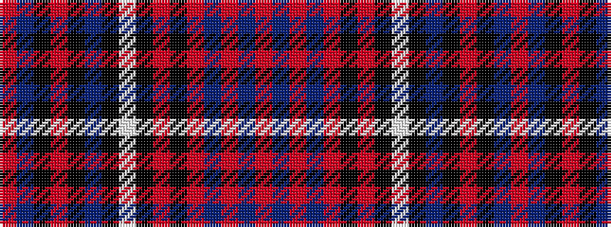

RBKRKBKWKRKRBRBR

It is a 16 stripe tartan.

<figure class="pat-woven">

<figcaption>idealised sample</figcaption>
</figure>

## Colour Sequence



## Tartans with this colour sequence

| Tartans |
|---------------|
| [Royal Canadian Air Force #2](/setts/s16/r3t7k1r2k1t12k4w3k2r1k1r1db3r2db4r2~x2/)|
||
