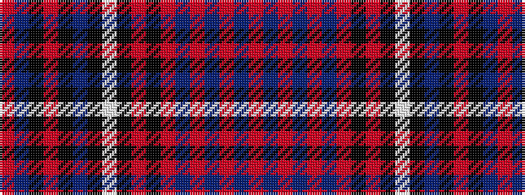

RBKRKBKWKRKRBRBRBR

It is a 18 stripe tartan.

<figure class="pat-woven">

<figcaption>idealised sample</figcaption>
</figure>

## Colour Sequence



## Tartans with this colour sequence

| Tartans |
|---------------|
| [Royal Canadian Air Force](/variants/s18/r4t6k1r2k1t14k3w3k2r2k2r2db4r2db6r2db6r2~x2/)|
||
| [Royal Canadian Air Force](/variants/s18/m4t6k1m2k1t14k3w3k2m2k2m2db4m2db6m2db6m3/)|
||
| [Royal Canadian Air Force Regimental Tartan](/variants/s18/r4t6k1r2k1t14k3w3k2r2k2r2db4r2db6r2db6r3/)|
||
