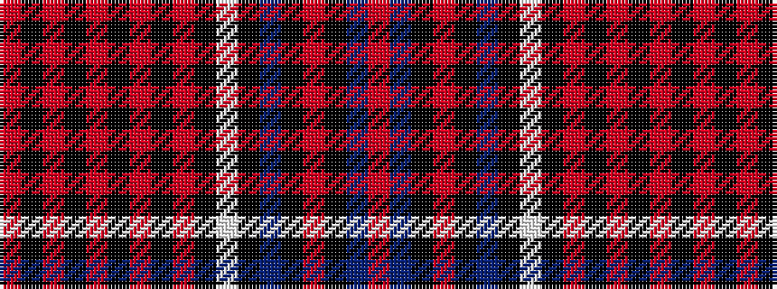

RBKRKBKWKRKRKRKRKR

It is a 18 stripe tartan.

<figure class="pat-woven">

<figcaption>idealised sample</figcaption>
</figure>

## Colour Sequence



## Tartans with this colour sequence

| Tartans |
|---------------|
| [Royal Canadian Air Force #3](/setts/s18/r4k8r3k6r3k4r3k2r4k2w3k2t16k1r4k1t8r4~x2/)|
||
