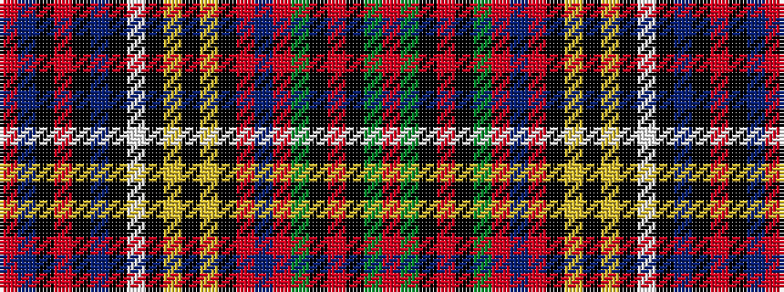

RBKRKBKWKYKYKRBRGKRKGR

It is a 22 stripe tartan.

<figure class="pat-woven">

<figcaption>idealised sample</figcaption>
</figure>

## Colour Sequence



## Tartans with this colour sequence

| Tartans |
|---------------|
| [Anderson (Coulson Bonner #2)](/variants/s22/r3dg6k1r2k1dg6r2db5r2k2ly2k2ly2k3w3k3b14k1r2k1b6r3~x2/)|
||
| [Anderson 11](/variants/s22/r3g6k1r2k1g6r2db5r2k2ly2k2ly2k3w3k3b14k1r2k1b6r3~x2/)|
||
| [Anderson Variant Clan Tartan](/variants/s22/r3g6k1r2k1g6r2db5r2k2ly2k2ly2k3w3k3t14k1r2k1t6r3~x2/)|
||
