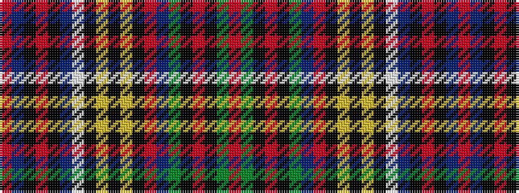

RBKRKBWKYKYKRBGKRKGR

It is a 20 stripe tartan.

<figure class="pat-woven">

<figcaption>idealised sample</figcaption>
</figure>

## Colour Sequence



## Tartans with this colour sequence

| Tartans |
|---------------|
| [Anderson Old (Makinlay)](/variants/s20/r8dg16k1r4k1dg16t14r2k14ly2k4ly2k1w8t52k1r4k1t16r8~x2/)|
||
| [Anderson, Old](/variants/s20/r8g16k1r4k1g16t14r2k14ly2k4ly2k1w8t52k1r4k1t16r8~x2/)|
||
