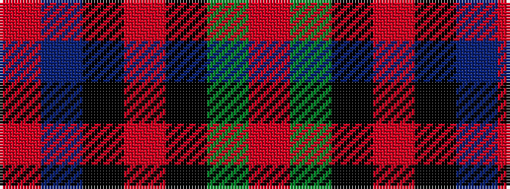

RBKRKGR

It is a 7 stripe tartan.

<figure class="pat-woven">

<figcaption>idealised sample</figcaption>
</figure>

## Colour Sequence



## Tartans with this colour sequence

| Tartans |
|---------------|
| [Triad Highland Games Proposed](/variants/s7/r1g8k8r1k8t8r1~x4/)|
||
