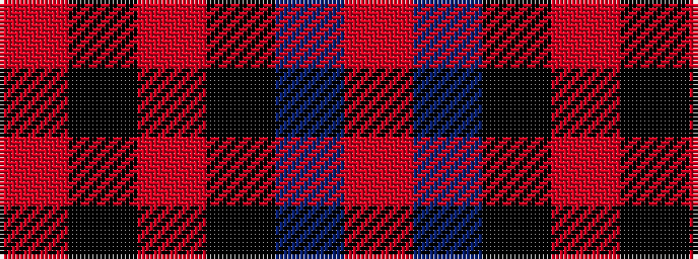

RBKRKR

It is a 6 stripe tartan.

<figure class="pat-woven">

<figcaption>idealised sample</figcaption>
</figure>

## Colour Sequence



## Tartans with this colour sequence

| Tartans |
|---------------|
| [Harley Davidson (Corporate)](/setts/s6/oi4n6k4o8k49oi2/)|
||
