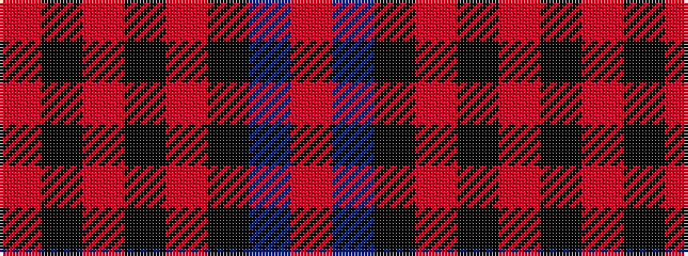

RBKRKRKR

It is a 8 stripe tartan.

<figure class="pat-woven">

<figcaption>idealised sample</figcaption>
</figure>

## Colour Sequence



## Tartans with this colour sequence

| Tartans |
|---------------|
| [Kinnaird (Australia) (Name)](/variants/s8/o33k4o4k5o4k7db41r4~x2/)|
||
