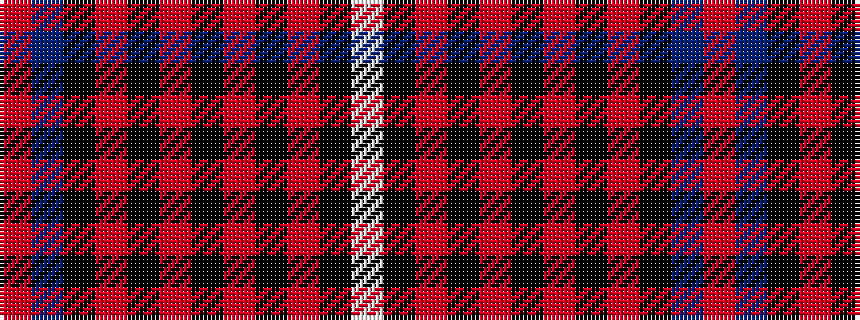

RBKRKRKRKRKW

It is a 12 stripe tartan.

<figure class="pat-woven">

<figcaption>idealised sample</figcaption>
</figure>

## Colour Sequence



## Tartans with this colour sequence

| Tartans |
|---------------|
| [Duchess of Kent](/variants/s12/r3t19k4r3k3r7k3r5k3r5k2w2~x2/)|
||
