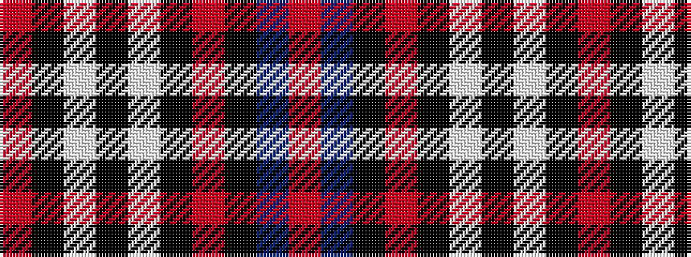

RBKRKWKWKR

It is a 10 stripe tartan.

<figure class="pat-woven">

<figcaption>idealised sample</figcaption>
</figure>

## Colour Sequence



## Tartans with this colour sequence

| Tartans |
|---------------|
| [Meeting Professionals International](/variants/s10/o10k3w3k3w3k3o10k7db20r3~x2/)|
||
