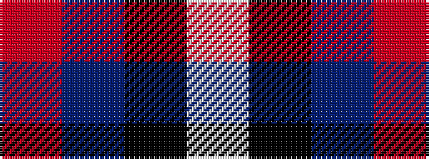

RBKW

It is a 4 stripe tartan.

<figure class="pat-woven">

<figcaption>idealised sample</figcaption>
</figure>

## Colour Sequence



## Tartans with this colour sequence

| Tartans |
|---------------|
| [Mirror (Corporate)](/setts/s4/r5db26k12w2~x4/)|
||
| [Scottish Nuclear](/setts/s4/r4db32k15w2~x2/)|
||
| [Scottish Nuclear (Corporate)](/setts/s4/r1db9k4lb1~x4/)|
||
