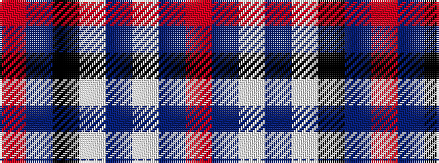

RBKWBWBR

It is a 8 stripe tartan.

<figure class="pat-woven">

<figcaption>idealised sample</figcaption>
</figure>

## Colour Sequence



## Tartans with this colour sequence

| Tartans |
|---------------|
| [Irn Bru](/setts/s8/r49b16k2w3b2w2b3r2~x2/)|
||
| [Irn Bru (Corporate)](/setts/s8/o49db16k2w3db2w2db3o2~x2/)|
||
