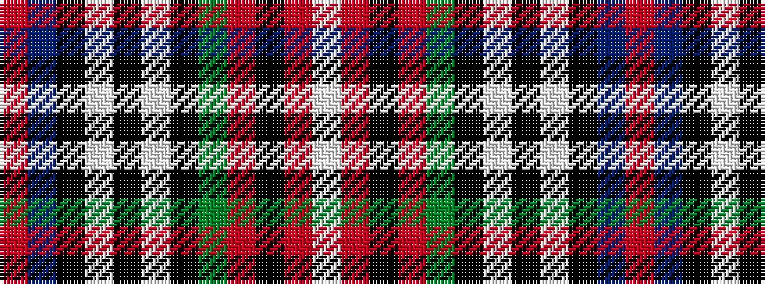

RBKWKWKGRKRW

It is a 12 stripe tartan.

<figure class="pat-woven">

<figcaption>idealised sample</figcaption>
</figure>

## Colour Sequence



## Tartans with this colour sequence

| Tartans |
|---------------|
| [Stewart - Pr Ch Ed (Error?)](/variants/s12/r16t10k14w2k4w3k4g26r11k4r4w2~x2/)|
||
