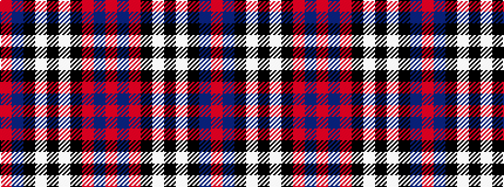

RBKWKWKRBR

It is a 10 stripe tartan.

<figure class="pat-woven">

<figcaption>idealised sample</figcaption>
</figure>

## Colour Sequence



## Tartans with this colour sequence

| Tartans |
|---------------|
| [Robberstad #2](/variants/s10/r60db8r4k11w2k11w2k11db1r4~x2/)|
||
