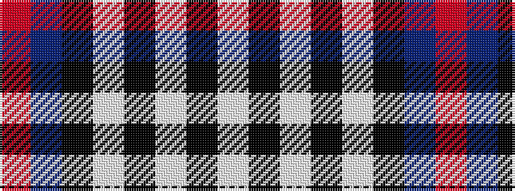

RBKWKWKW

It is a 8 stripe tartan.

<figure class="pat-woven">

<figcaption>idealised sample</figcaption>
</figure>

## Colour Sequence



## Tartans with this colour sequence

| Tartans |
|---------------|
| [Kinnaird](/variants/s8/lb33k4lb4k5lb4k7db41r4~x2/)|
||
