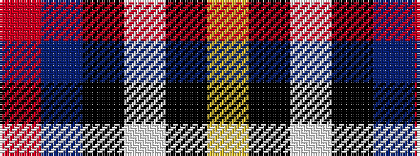

RBKWKY

It is a 6 stripe tartan.

<figure class="pat-woven">

<figcaption>idealised sample</figcaption>
</figure>

## Colour Sequence



## Tartans with this colour sequence

| Tartans |
|---------------|
| [MacTavish / Thom(p)son, dress](/variants/s6/r4t28k6w12k12ly3~x2/)|
||
| [MacTavish Dress](/variants/s6/r4t28k6lb12k12lo3~x2/)|
||
| [Thomson Dress (Blue)](/variants/s6/r1b10k2w4k4ly1~x6/)|
||
