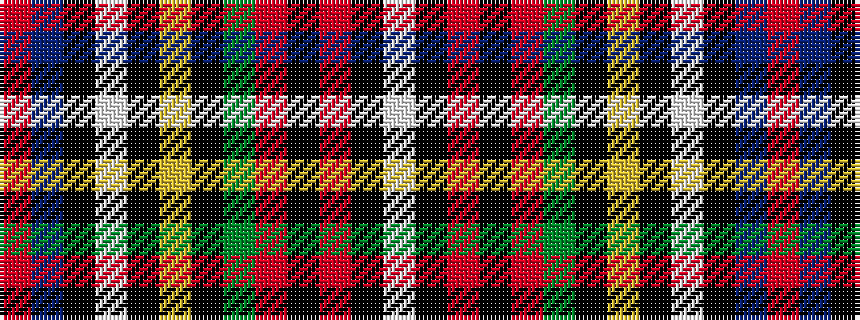

RBKWKYKGRKRKW

It is a 13 stripe tartan.

<figure class="pat-woven">

<figcaption>idealised sample</figcaption>
</figure>

## Colour Sequence



## Tartans with this colour sequence

| Tartans |
|---------------|
| [Mary Stewart, Queen of Scots](/setts/s13/ri25db5k5w4k2ly2k2g8r6k2ri3k1w2~x2/)|
||
