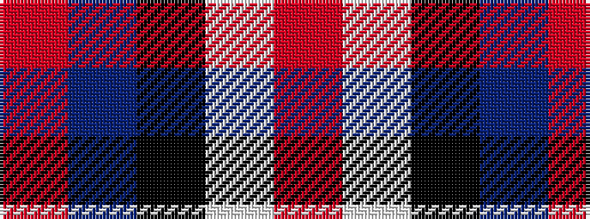

RBKWR

It is a 5 stripe tartan.

<figure class="pat-woven">

<figcaption>idealised sample</figcaption>
</figure>

## Colour Sequence



## Tartans with this colour sequence

| Tartans |
|---------------|
| [Inder (Corporate)](/setts/s5/r2dp8k8w1r2~x2/)|
||
