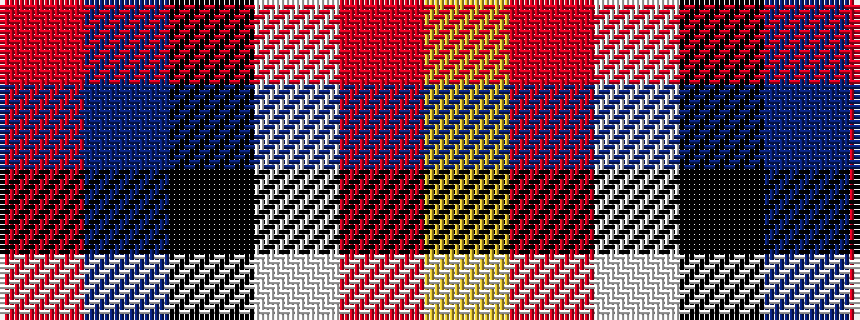

RBKWRY

It is a 6 stripe tartan.

<figure class="pat-woven">

<figcaption>idealised sample</figcaption>
</figure>

## Colour Sequence



## Tartans with this colour sequence

| Tartans |
|---------------|
| [LLoyd of Astargus Canadian Family Tartan](/variants/s6/r3db38k13w3o20ly2~x2/)|
||
| [Lloyd of Astargus](/variants/s6/r2db61k13w2o20lo2~x2/)|
||
