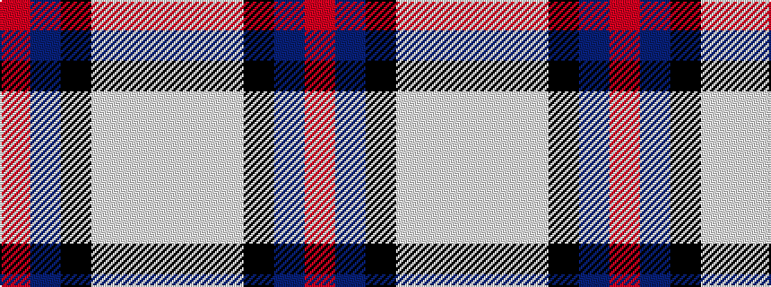

RBKWWW

It is a 6 stripe tartan.

<figure class="pat-woven">

<figcaption>idealised sample</figcaption>
</figure>

## Colour Sequence



## Tartans with this colour sequence

| Tartans |
|---------------|
| [St. Christopher's School (Corporate)](/variants/s6/lb20w2lb5k2b10r3~x2/)|
||
