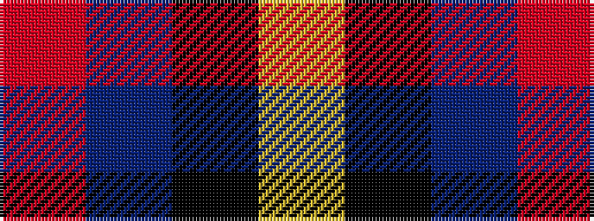

RBKY

It is a 4 stripe tartan.

<figure class="pat-woven">

<figcaption>idealised sample</figcaption>
</figure>

## Colour Sequence



## Tartans with this colour sequence

| Tartans |
|---------------|
| [Broberg (Scania) (Personal)](/setts/s4/r80t40k5lo6/)|
||
| [Rogues (United States), The](/setts/s4/r3n12k50ly3~x2/)|
||
| [Rogues, The (Corporate)](/setts/s4/r3t12k50ly3~x2/)|
||
