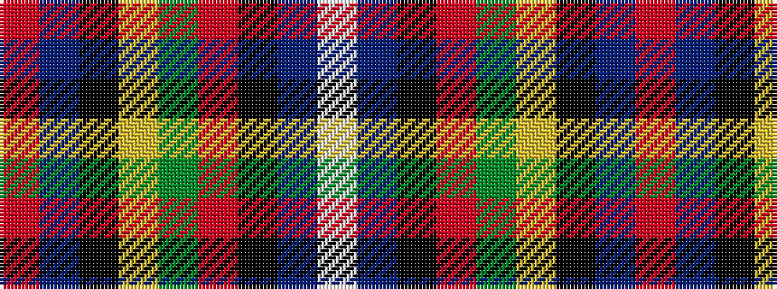

RBKYGRKBW

It is a 9 stripe tartan.

<figure class="pat-woven">

<figcaption>idealised sample</figcaption>
</figure>

## Colour Sequence



## Tartans with this colour sequence

| Tartans |
|---------------|
| [Gillespie](/variants/s9/r13t1k3ly1g4r1k2t1w1~x4/)|
||
