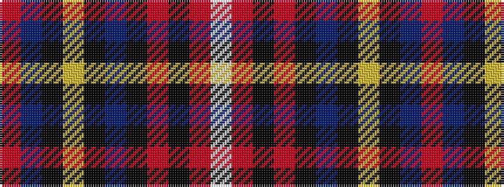

RBKYKBKRKRW

It is a 11 stripe tartan.

<figure class="pat-woven">

<figcaption>idealised sample</figcaption>
</figure>

## Colour Sequence



## Tartans with this colour sequence

| Tartans |
|---------------|
| [Glen Stewart](/setts/s11/r1db15k2ly1k1b1k5r4k1r2lb1~x4/)|
||
