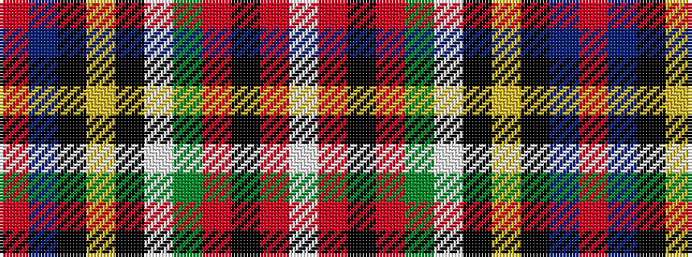

RBKYKWGRKRW

It is a 11 stripe tartan.

<figure class="pat-woven">

<figcaption>idealised sample</figcaption>
</figure>

## Colour Sequence



## Tartans with this colour sequence

| Tartans |
|---------------|
| [Followers' Plaid](/setts/s11/r48t8k10ly2k3w2g25r10k3r3w2~x2/)|
||
| [Royal Stewart](/setts/s11/r64t12k16ly2k4w3dg32r8k4r3w2~x2/)|
||
