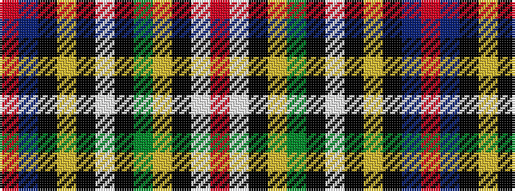

RBKYKWKGYKWR

It is a 12 stripe tartan.

<figure class="pat-woven">

<figcaption>idealised sample</figcaption>
</figure>

## Colour Sequence



## Tartans with this colour sequence

| Tartans |
|---------------|
| [Drummond Relic](/variants/s12/r26w1k8ly1dg13k1w4k1ly2k4t3r8~x4/)|
||
| [Drummond, Relic](/variants/s12/r26w1k8ly1g13k1w4k1ly2k4t3r8~x4/)|
||
