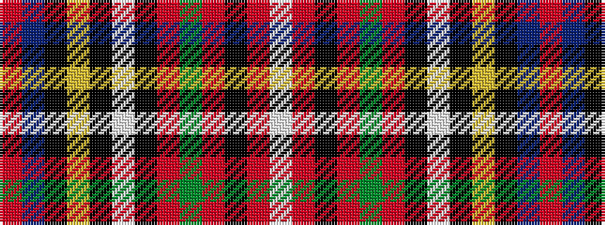

RBKYKWKRGRKRW

It is a 13 stripe tartan.

<figure class="pat-woven">

<figcaption>idealised sample</figcaption>
</figure>

## Colour Sequence



## Tartans with this colour sequence

| Tartans |
|---------------|
| [Carolina](/variants/s13/r32t14k16ly3k4w4k4r1g28r13k4r4w2~x2/)|
||
| [Carolina, States of](/variants/s13/r32t14k16ly3k4w4k4r1y28r13k4r4w2~x2/)|
||
