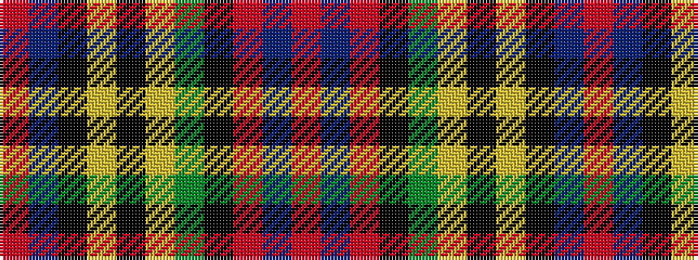

RBKYKYGKRBR

It is a 11 stripe tartan.

<figure class="pat-woven">

<figcaption>idealised sample</figcaption>
</figure>

## Colour Sequence



## Tartans with this colour sequence

| Tartans |
|---------------|
| [Unnamed No 1](/variants/s11/r8t7k8ly2k1ly1g19k1r8t3r8~x2/)|
||
