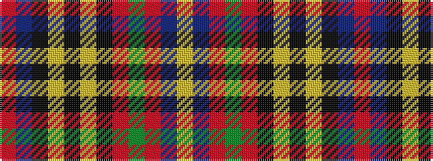

RBKYKYKRGRBY

It is a 12 stripe tartan.

<figure class="pat-woven">

<figcaption>idealised sample</figcaption>
</figure>

## Colour Sequence



## Tartans with this colour sequence

| Tartans |
|---------------|
| [Hepburn](/setts/s12/r21db4k5ly2k2ly2k2r7g4r2db3ly2~x2/)|
||
| [Hepburn (Clan)](/setts/s12/r21db4k5ly2k2ly2k2r7g4r2db3ly2~x4/)|
||
