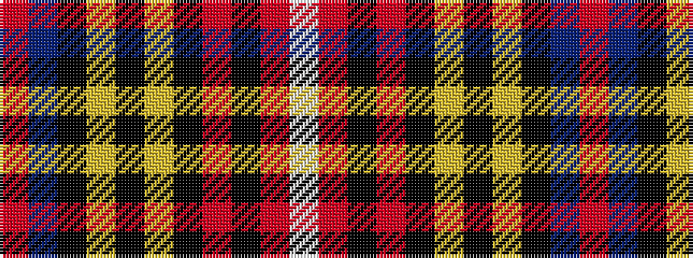

RBKYKYKRKRW

It is a 11 stripe tartan.

<figure class="pat-woven">

<figcaption>idealised sample</figcaption>
</figure>

## Colour Sequence



## Tartans with this colour sequence

| Tartans |
|---------------|
| [Heritage Plaid](/setts/s11/r44db3k6lo2k2lo2k10r5k2r3w2~x2/)|
||
