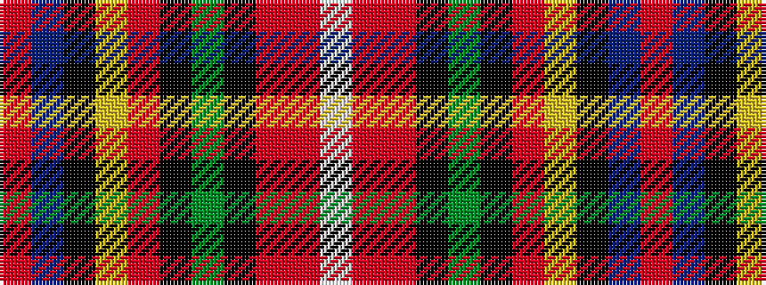

RBKYRKGKRRW

It is a 11 stripe tartan.

<figure class="pat-woven">

<figcaption>idealised sample</figcaption>
</figure>

## Colour Sequence



## Tartans with this colour sequence

| Tartans |
|---------------|
| [Unnamed 18th century plaid (Carlisle Museum)](/setts/s11/r2db2k3ly3r3k3dy10k12m3r16w1~x2/)|
||
