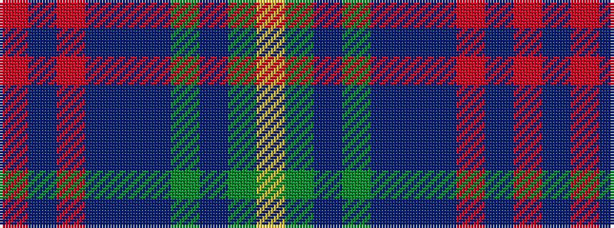

RBRBBBGBGY

It is a 10 stripe tartan.

<figure class="pat-woven">

<figcaption>idealised sample</figcaption>
</figure>

## Colour Sequence



## Tartans with this colour sequence

| Tartans |
|---------------|
| [Donegal, County](/setts/s10/lo3dg17b3dg3b3do5b18r2b8r2~x2/)|
||
