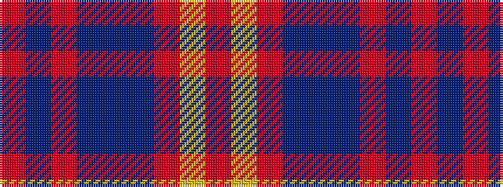

RBRBBBRYR

It is a 9 stripe tartan.

<figure class="pat-woven">

<figcaption>idealised sample</figcaption>
</figure>

## Colour Sequence



## Tartans with this colour sequence

| Tartans |
|---------------|
| [Bedford Academy (Corporate)](/setts/s9/o8ly4o35db2t8db2o4db21o4~x2/)|
||
