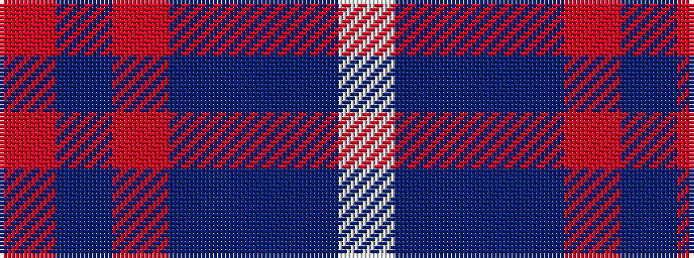

RBRBBBW

It is a 7 stripe tartan.

<figure class="pat-woven">

<figcaption>idealised sample</figcaption>
</figure>

## Colour Sequence



## Tartans with this colour sequence

| Tartans |
|---------------|
| [Blue](/variants/s7/r2db11r3db11t12dbi10w2~x2/)|
||
| [Blue Family Tartan](/variants/s7/r2dbi11r3dbi11t12db10w2~x2/)|
||
