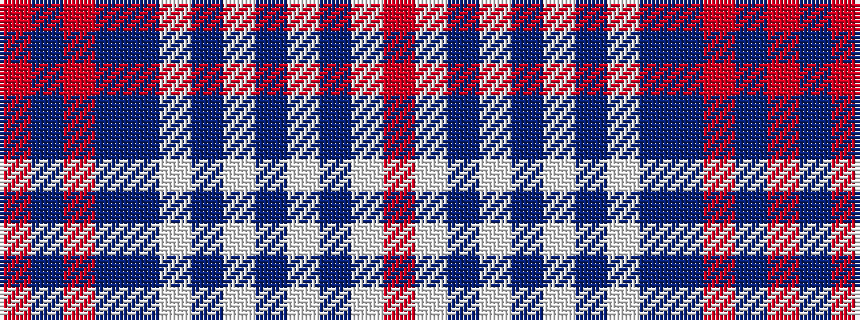

RBRBBWBWBWBWR

It is a 13 stripe tartan.

<figure class="pat-woven">

<figcaption>idealised sample</figcaption>
</figure>

## Colour Sequence



## Tartans with this colour sequence

| Tartans |
|---------------|
| [Hogmany Plaid (Fashion)](/setts/s13/r2w7dt3w3dt3w3dt3w1dt12db14r1db1r2~x2/)|
||
