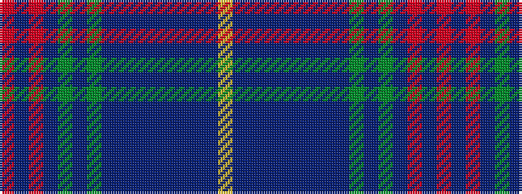

RBRBGBGBBBBBBBBY

It is a 16 stripe tartan.

<figure class="pat-woven">

<figcaption>idealised sample</figcaption>
</figure>

## Colour Sequence



## Tartans with this colour sequence

| Tartans |
|---------------|
| [St Margaret's School for Girls, Aberdeen](/variants/s16/r6db3r3db54g6db3g6db4t24dbi4t4dbi50db6dbi4db12lo4/)|
||
