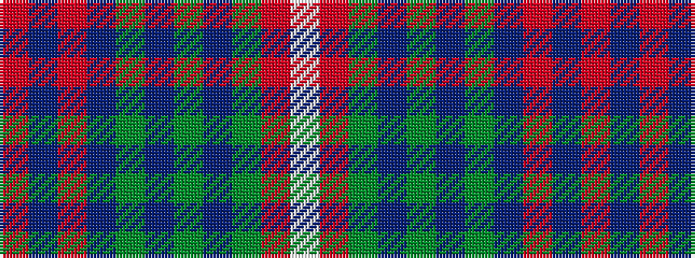

RBRBGBGBGRW

It is a 11 stripe tartan.

<figure class="pat-woven">

<figcaption>idealised sample</figcaption>
</figure>

## Colour Sequence



## Tartans with this colour sequence

| Tartans |
|---------------|
| [Waddell (Fife), Greg](/variants/s11/r3db2r24db8g2db2g2db2g10r3w2~x2/)|
||
| [Waddell (Name)](/variants/s11/r3db2r24db8dg2db2dg2db2dg10r3w2~x2/)|
||
