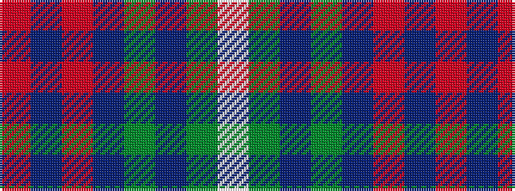

RBRBGBGW

It is a 8 stripe tartan.

<figure class="pat-woven">

<figcaption>idealised sample</figcaption>
</figure>

## Colour Sequence



## Tartans with this colour sequence

| Tartans |
|---------------|
| [Redpath, Robert A (Personal)](/variants/s8/r26n4r1p2dg1n4dg14w2~x2/)|
||
