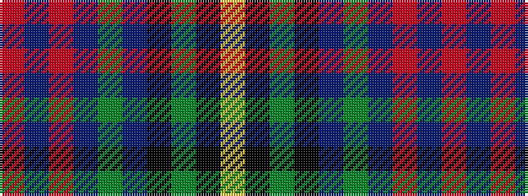

RBRBGBKGKY

It is a 10 stripe tartan.

<figure class="pat-woven">

<figcaption>idealised sample</figcaption>
</figure>

## Colour Sequence



## Tartans with this colour sequence

| Tartans |
|---------------|
| [Royal Air Force Lossiemouth](/variants/s10/o3t18r2t18g3dt8k20g2k5lo3~x2/)|
||
