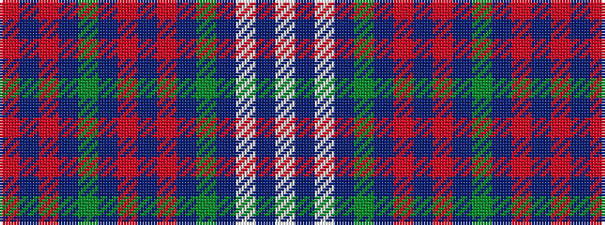

RBRBGBRBRBGBWBW

It is a 15 stripe tartan.

<figure class="pat-woven">

<figcaption>idealised sample</figcaption>
</figure>

## Colour Sequence



## Tartans with this colour sequence

| Tartans |
|---------------|
| [International School of Aberdeen](/setts/s15/w3db4w1db2g1db3r10db2r2db3g1db3r2db32r1~x2/)|
||
