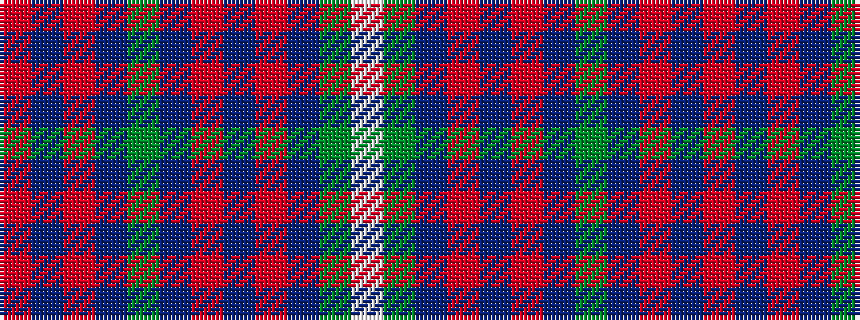

RBRBGBRBRBGW

It is a 12 stripe tartan.

<figure class="pat-woven">

<figcaption>idealised sample</figcaption>
</figure>

## Colour Sequence



## Tartans with this colour sequence

| Tartans |
|---------------|
| [Meath](/variants/s12/o5db2r14dr9g8t3r3t3r3t3g19w3~x2/)|
||
