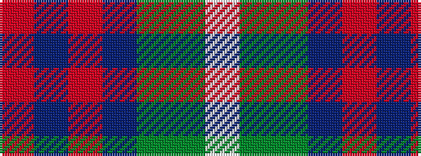

RBRBGGW

It is a 7 stripe tartan.

<figure class="pat-woven">

<figcaption>idealised sample</figcaption>
</figure>

## Colour Sequence



## Tartans with this colour sequence

| Tartans |
|---------------|
| [Gift of Life Michigan (Corporate)](/variants/s7/r2t1r1t11g16dg1w1~x2/)|
||
