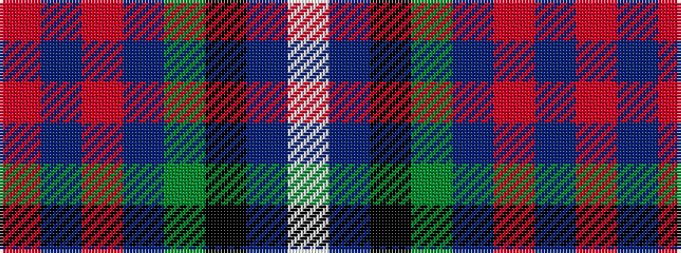

RBRBGKBW

It is a 8 stripe tartan.

<figure class="pat-woven">

<figcaption>idealised sample</figcaption>
</figure>

## Colour Sequence



## Tartans with this colour sequence

| Tartans |
|---------------|
| [St. Margaret Youth Group (Corporate)](/setts/s8/r30db5r3db33g8k3db8w2~x2/)|
||
