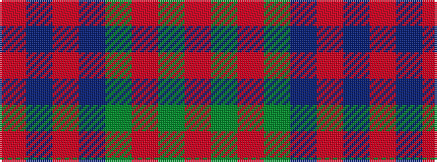

RBRBGRGR

It is a 8 stripe tartan.

<figure class="pat-woven">

<figcaption>idealised sample</figcaption>
</figure>

## Colour Sequence



## Tartans with this colour sequence

| Tartans |
|---------------|
| [Flora MacDonald](/variants/s8/r3dg3r3dg10db10r3db3r3~x2/)|
||
| [Flora, MacDonald](/variants/s8/r3db3r3db10g10r3g3r3~x2/)|
||
