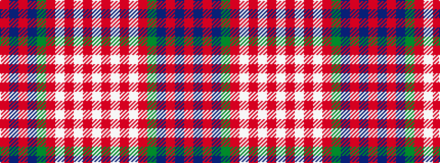

RBRBGRWRWRW

It is a 11 stripe tartan.

<figure class="pat-woven">

<figcaption>idealised sample</figcaption>
</figure>

## Colour Sequence



## Tartans with this colour sequence

| Tartans |
|---------------|
| [Ben Ledi (Fashion)](/variants/s11/w60o3w3o8w3o3y24dt12o3dt16o4/)|
||
