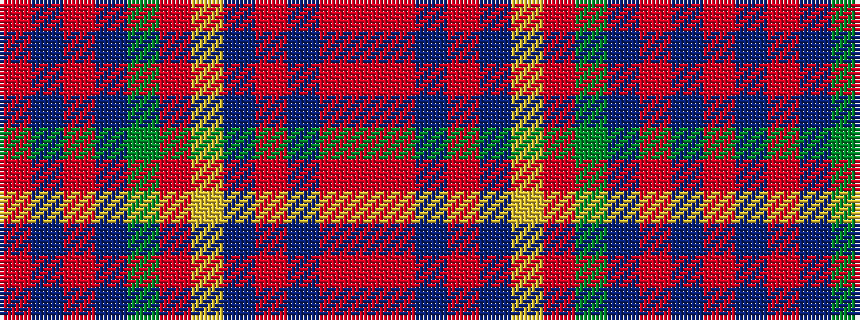

RBRBGRYBRBRR

It is a 12 stripe tartan.

<figure class="pat-woven">

<figcaption>idealised sample</figcaption>
</figure>

## Colour Sequence



## Tartans with this colour sequence

| Tartans |
|---------------|
| [Maple Leaf Blue](/variants/s12/r15db3r3db19y6o6lo6db19r3db3r15o13~x4/)|
||
