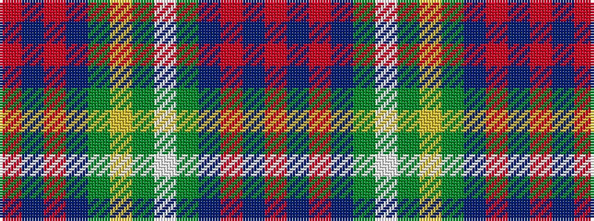

RBRBGWGYGBRBR

It is a 13 stripe tartan.

<figure class="pat-woven">

<figcaption>idealised sample</figcaption>
</figure>

## Colour Sequence



## Tartans with this colour sequence

| Tartans |
|---------------|
| [Clackson Hunting (Personal)](/setts/s13/r4db5r4db5g8w2g24ly2g8db5r4db5r4~x2/)|
||
