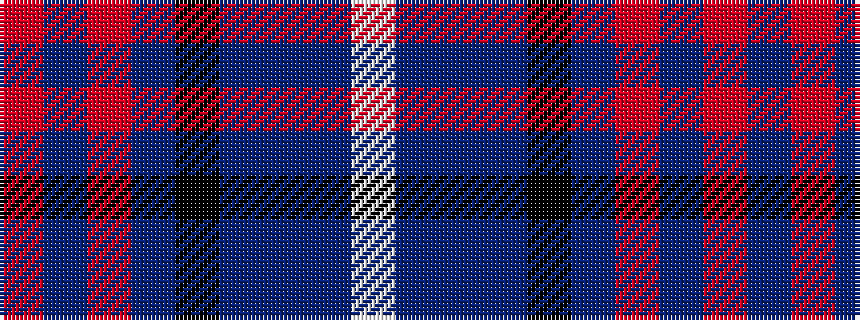

RBRBKBBBW

It is a 9 stripe tartan.

<figure class="pat-woven">

<figcaption>idealised sample</figcaption>
</figure>

## Colour Sequence



## Tartans with this colour sequence

| Tartans |
|---------------|
| [Fitzgerald (Family)](/setts/s9/r3b22r3b3k14b14t3b3w2~x2/)|
||
| [Fitzgerald, Blue](/setts/s9/r3db21r3db3k13db13t3db3w2~x2/)|
||
