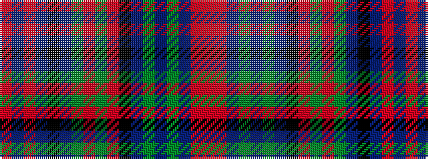

RBRBKBGRGRKBGBGBRR

It is a 18 stripe tartan.

<figure class="pat-woven">

<figcaption>idealised sample</figcaption>
</figure>

## Colour Sequence



## Tartans with this colour sequence

| Tartans |
|---------------|
| [Cooper/Couper (James Cant)](/setts/s18/r2m3db2g18db3g2db3k10m3g2m3g8db2k2db14m3db2r2~x2/)|
||
