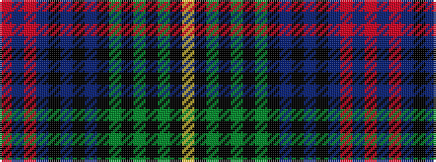

RBRBKBKBKGKGKGKY

It is a 16 stripe tartan.

<figure class="pat-woven">

<figcaption>idealised sample</figcaption>
</figure>

## Colour Sequence



## Tartans with this colour sequence

| Tartans |
|---------------|
| [Herriot (Personal)](/setts/s16/m2db1m1db12k1db1k1db1k5g1k1g1k1g5k2ly1~x4/)|
||
