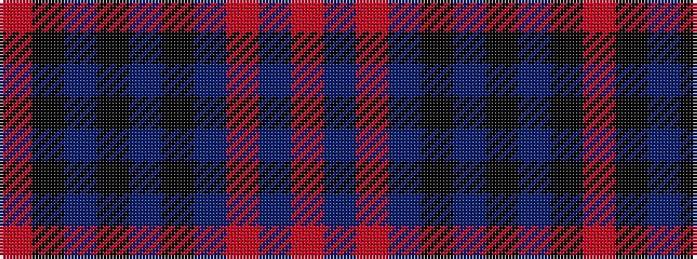

RBRBKBKBKR

It is a 10 stripe tartan.

<figure class="pat-woven">

<figcaption>idealised sample</figcaption>
</figure>

## Colour Sequence



## Tartans with this colour sequence

| Tartans |
|---------------|
| [Myles, Lee](/setts/s10/m2n3m1n9k4n13k33n1k4m1~x2/)|
||
